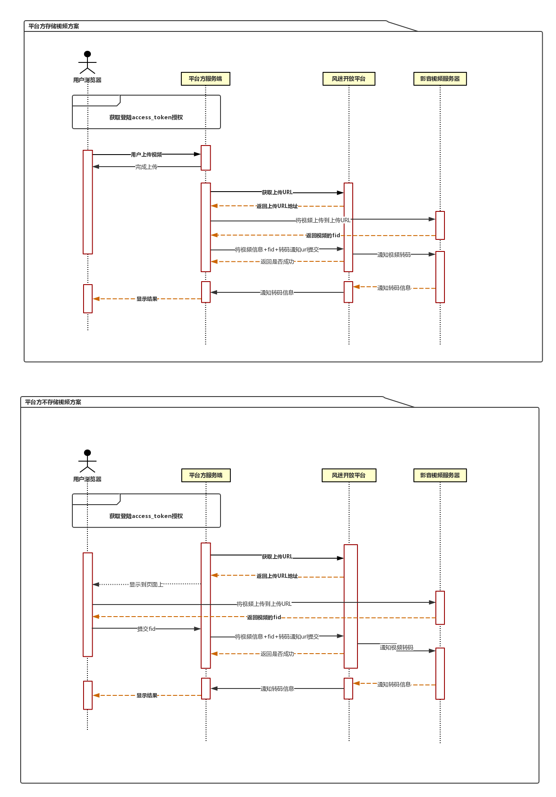

## 接入指南

### 接入流程

QQ登录OAuth2.0总体处理流程如下：
```
Step1：申请接入，获取`appid`和`apikey`；
Step2：放置登录按钮；
Step3：通过用户登录验证和授权，获取`access_token`；
Step4：通过`access_token`获取用户的`openid`和用户资料；
Step5：调用`OpenAPI`，来请求访问或修改用户授权的资源。
```

### 环境说明

开发环境: `http://fengmiweb.riverrun.cn/`
正式环境：`https://fengmi.tv`

> 注意：开发环境使用`http`协议，正式环境使用`https`协议

### 登陆授权流程


> 拿到`access_token`和`openid`,即可请求对应`API`接口进行相关操作


### 上传视频流程

